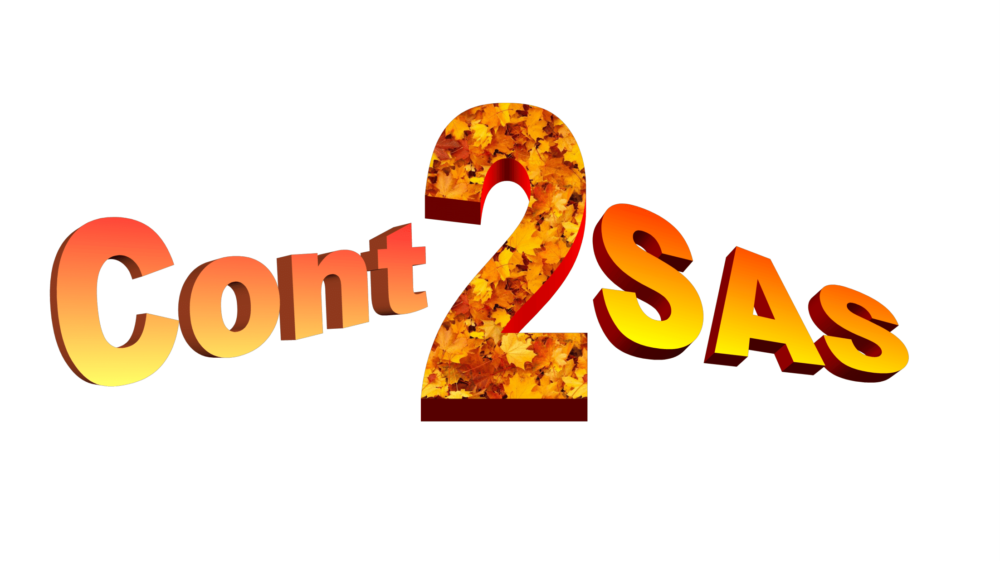

<!-- <p align="center">

</p> -->


# Calculation of SAS pattern from simulated continuum structures

<!-- <p align="center">
  
</p> -->

## Description

Software package for calculating Small Angle Scattering (SAS) pattern from continuum simulations.

<!--  -->


## Installation

### Run from source

Download the repository

```
$ git clone git@codebase.helmholtz.cloud:arnab.majumdar/continuum-to-scattering.git
$ cd continuum-to-scattering
```

Create conda environemnt 

Install packages using ``.yml``

```
$ conda env create -f environment.yml
$ conda activate Cont2Sas
```

Install using ``pip``

```
$ conda create -n Cont2Sas -n test python=3.12.1
$ conda activate Cont2Sas
$ pip install -r requirements.txt
```


```
conda remove --name Cont2Sas --all
```
### Required packages

#### Sassena


```
# dowload
$ wget https://codebase.helmholtz.cloud/api/v4/projects/6801/packages/generic/sassena/v1.9.2-f31e3882/Sassena_CPU.AppImage
$ chmod +x Sassena.AppImage
$ ./Sassena.AppImage # --config scatter.xml etc.
# or to use mpi:
$ mpirun -n 16 ./Sassena.AppImage --config scatter.xml

```

## Steps to run
### Mesh generation

#### Functionalities

1. define simulation box (only rectangular possible)
2. define node positions
3. define element centres 
4. define connectivity matrix
4. define element type (only lagrangian of order 1 and 2 possible)

#### Run using xml

##### Define struct.xml

1. create struct.xml in xml folder
2. define the following (find [template](https://codebase.helmholtz.cloud/arnab.majumdar/continuum-to-scattering/-/blob/develop/xml/Template/struct.xml?ref_type=heads)):

    - lengths = dimension of simulation box in x,y,z
    - num_cell = num elements in x,y,z directions
    - element
        - type = type of element (allowed: 'lagrangian')
        - order = order of element (allowed: 1 or 2)
    - decision
        - update_val = whether to rewrite the structure or not (preferred= 'True')
        - plot
            - node = decision to plot nodes (preffered: 'False') 
            - cell = decision to plot element centers (preffered: 'False')
            - mesh = decision to plot mesh (preffered: 'False')

##### Generate mesh

Run following code:

``` 
cd $proj_home

$python ./src/struct_gen.py
```

##### Output

Check the output in following location:

- Folder name = ``${proj_home}/data``

### Assign SLD values to nodes

#### Functionalities

1. define time step (only cons time steps possible)
2. read mesh info 
3. assign slds to nodes
4. repeat 3 for all time steps

#### Run using xml

##### Define simulation.xml

1. create simulation.xml in xml folder
2. define the following (find [template](https://codebase.helmholtz.cloud/arnab.majumdar/continuum-to-scattering/-/blob/develop/xml/Template/simulation.xml?ref_type=heads)):

    - sim_model = name of the model (e.g.'sld_grow')
    - dt = time step length
    - t_end = end time (start time is 0)
    - n_ensem = number of structures per time step (ensemble of structure in one time step)

##### Define model xml

1. create model_{modelname}.xml in xml folder
2. need to create your own
3. see below for example models

##### Assign sld to nodes

Run following code:

``` 
cd $proj_home

$python ./src/simulation.py
```

##### Output

Check the output in following location:

- Folder name = ``${proj_home}/data/${struct_dir}/simulation/${simu_dir}/${model_dir}``

### Calculation of SAS patterns

#### Functionalities

1. read mesh info
2. read assigned slds 
3. calculate SAS pattern numerically
4. repeat 3 for all time steps

#### Run using xml

##### Define scatt_cal.xml

1. create scatt_cal.xml in xml folder
2. define the following (find [template](https://codebase.helmholtz.cloud/arnab.majumdar/continuum-to-scattering/-/blob/develop/xml/Template/scatt_cal.xml?ref_type=heads)):

- num_cat = num categories for categorization
method_cat = categorization method (allowed : 'direct', 'extend')
- sassena_exe = Sassena executable location ([Check here](https://codebase.helmholtz.cloud/DAPHNE4NFDI/sassena/))
- mpi_procs = number of mpi processes used by Sassena
- num_threads = number of threads used by Sassena
- sig_file = signal file name (preferred: 'signal.h5', must include '.h5' in the end)
- scan_vec = vector along which Q values will be closen (e.g. np.array([1, 0, 0]))
- Q_range = start and end values of Q (e.g. np.array([0., 1.]), must be float)
- num_points = number of Q points
- num_orientation = number of orientations used for numerical orientational averaging

##### Calculate SAS pattern

Run following code:

``` 
cd $proj_home

$python ./src/scatt_cal.py
```

##### Output

Check the output in following location:

- Folder name = ``${proj_home}/data/${struct_dir}/simulation/${simu_dir}/${model_dir}/${time}``

### Calculation of effective cross-section

#### Functionalities

1. generate pixels of detector
2. read SAS pattern and detctor pixel info 
3. calculate effective cross-section
4. repeat 2,3 for all time steps

#### generate pixels of detector

This step is required only of ``detector.h5`` does not exist in ``/detector_geometry/${instru_name}_${facility_name}/``.

``` 
cd $proj_home/detector_geometry/${instru_name}_${facility_name}/

$python ./simu_detector.py

cd $proj_home
```

The output ``detector.h5`` contains following:

- nx, ny = num pixels in detector in x, y dimensions
- dx, dy = pixel width in x and y dimensions
- bs_wx, bs_wy = beam stopper width in x and y dimensions

#### Run using xml

##### Define sig_eff.xml

1. create sig_eff.xml in xml folder
2. define the following (find [template](https://codebase.helmholtz.cloud/arnab.majumdar/continuum-to-scattering/-/blob/develop/xml/Template/sig_eff.xml?ref_type=heads)):

    - instrument = instrument name (allowed: 'SANS-1')
    - facility = name of facility (allowed: 'MLZ')
    - distance = distance between detector and sample
    - wl = wavelength of neutron
    - beam_center_coord = vector defining center of beam w.r.t. detector center (e.g. np.array([0, 0, 0]))

##### Calculate effective cross-section

Run following code:

``` 
cd $proj_home

$python ./src/sig_eff.py
```

##### Output

Check the output in following location:

- Folder name = ``${proj_home}/data/${struct_dir}/simulation/${simu_dir}/${model_dir}/${time}``

## Model structures

### ball

Description: Spherical nanoparticle</br>
Name: ball

Structure of ``model_ball.xml``:

- rad = radius of sphere
- sld = SLD of sphere
- qclean_sld = SLD outside simulation box

### box

Description: Parallelepiped naniparticle</br>
Name: box

Structure of ``model_box.xml``:

- sld = SLD of parallelepiped
- qclean_sld = SLD outside simulation box

### bib

Description: Parallepiped nanoparticle with spherical region at the center</br>
Name: ball in box (bib)

Structure of ``model_bib.xml``:

- rad = radius of sphere (must be <= simulation box length/2)
- sld_in = SLD of sphere
- sld_out = SLD of environment
- qclean_sld = SLD outside simulation box

### bib_ecc

Description: Parallepiped nanoparticle with spherical region off the center</br>
Name: ball in box eccentric (bib_ecc)

Structure of ``model_box.xml``:

- rad = radius of sphere (must be <= simulation box length/2)
- sld_in = SLD of sphere
- sld_out = SLD of environment
- ecc = vector w.r.t. simulation box center
    - x = x value of vector
    - y = y value of vector
    - z = z value of vector
- qclean_sld = SLD outside simulation box

### gg

Description: Growth of spherical grain over time</br>
Name: grain growth (gg)

Structure of ``model_gg.xml``:

- rad_0 = starting radius of sphere
- rad_end = end radius of sphere
- sld_in = SLD of sphere
- sld_out = SLD of environment
- qclean_sld = SLD outside simulation box

### fs

Description: Interdiffusion between spherical grain and its environment over time</br>
Name: fuzzy sphere (fs)

Structure of ``model_fs.xml``:

- rad = sphere radius
- sig_0 = starting fuzz value (>=0)
- sig_end = end fuzz value (>=0)
- sld_in = SLD of sphere
- sld_out = SLD of environment
- qclean_sld = SLD outside simulation box

### sld_grow

Description: Change of chemical composition of spherical grain over time</br>
Name: sld growth (sld_grow)

Structure of ``model_sld_grow.xml``:

- rad = sphere radius
- sld_in_0 = starting SLD of sphere
- sld_in_end = end SLD of sphere
- sld_out = SLD of environment
- qclean_sld = SLD outside simulation box


## FEM simulation

### phase_field
Description: Iron - Chromium spinodal decomposition

- name = name of the model (= 'spinodal_fe_cr')
- time = simulation time
- qclean sld = SLD outside simulation box