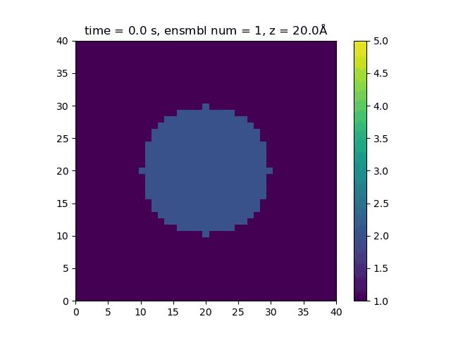

# sld_grow

Description: Change of chemical composition of spherical grain over time

Name: sld growth (sld_grow)

<!--  -->

## Copy model_sld_grow.xml template

```
# run from main folder
# relative position ../
cd $C2S_HOME
cp xml/Template/model_sld_grow.xml xml/
nano xml/model_sld_grow.xml
```

## Edit model_ball.xml

- rad = sphere radius
- sld_in_0 = starting SLD of sphere
- sld_in_end = end SLD of sphere
- sld_out = SLD of environment
- qclean_sld = SLD outside simulation box

## Go to workflow

[Workflow](../general/workflow.md#assign-sld-to-nodes)