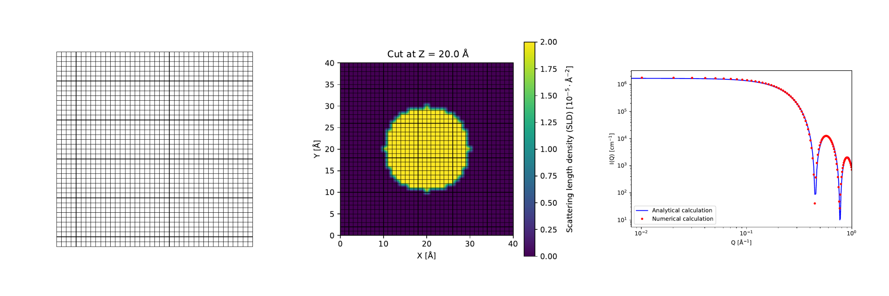
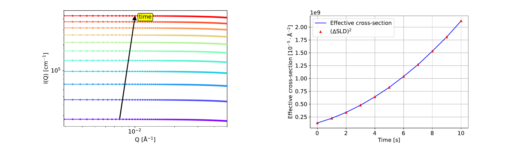

# Summary

`Cont2SAS` software facilitates calculation of Small Angle Scattering (SAS) data from Continuum (Cont) nanostructures. `Cont2SAS` is built on the existing software solution `Sassena` -- known for calculating scattering patterns from atomic structures `[@lindner2012sassena; lindner2012towards; @sassena:2017, sassena:2023; majumdar2024computation]`. `Cont2SAS` can calculate SAS patterns and effective cross-section. SAS patterns contain a SAS intensity $(I)$ vs scattering vector magnitude $(Q)$. The effective cross-section $(\sigma_{\text{eff}})$ is neutron count rate per unit flux, whose time evolution is calculated from SAS patterns calculated at different time steps. Through the comparison of calculated and measured SAS data, simulations and SAS experiments can be used in a complementary manner to validate simulations, tune simulation parameters, and analyze SAS data obtained from experiments `[@dorrell2020combined; @reich2022comparison; @majumdar2024computation]`.

# Statement of need

The simulation of material structure at the nanometer length scale can be performed using atomistic simulations and continuum simulations. Continuum simulations have an advantage over atomistic ones as continuum simulations can simulate bigger volumes for a larger time. However, continuum simulations are less accurate than the atomistic simulations. Therefore, `Cont2SAS` is created to check the accuracy of continuum simulations by validating them against SAS experiments, such as Small Angle Neutron Scattering (SANS) and Small Angle X-ray Scattering (SAXS). The validation is performed by comparing SAS data calculated using `Cont2SAS` with measured ones. A validated simulation can also be used to retrieve nanostructure from SAS data because a direct retrieval of nanstructure from SAS data is not possible. Continuum nanostructures can also be generated based on knowledge of the sample, instead of simulating them based on physics based equations. 

Both generated and simulated structures are expected to output either Scattering Length Density (SLD) ($\beta$) values or a set of variables (e.g. local molar density ($\rho_{\text{m}}$) and composition ($\chi$)) from which SLD values can be calculated. `Cont2SAS` creates a mesh, assigns SLD based on generated simulated values, and calculates SAS pattern from them, as shown in fig. \autoref{fig:sas_workflow}.

For some powder-like materials, the nanostructure does not change over time but the chemical composition changes. For such scenario, time evolution of neutron count rate can be an useful parameter `[@aslan2019high]`. Using `Cont2SAS`, the neutron count rate per unit neutron flux, which is named `effective cross-section` $(\sigma_{\text{eff}})$, can be calculated. Figure \autoref{figures/sig_eff.png} demonstrates such calculation from a series of SAS patterns. The calculated $(\sigma_{\text{eff}})$ must be multiplied by an empirical factor before comparing with measured neutron count rate.

`Cont2SAS` provides the much needed software platform for calculating SAS pattern from continuum simulations. The addition of effective cross-section in the software package is going be helpful for analyzing powder-like structures. One can also retrieve continuum nanostructures from SAS data using generated or simulated model structures.

# Acknowledgements

This publication was written in the context of the work of the consortium DAPHNE4NFDI in
association with the German National Research Data Infrastructure (NFDI) e.V. NFDI is financed by
the Federal Republic of Germany and the 16 federal states and the consortium is funded by the
Deutsche Forschungsgemeinschaft (DFG, German Research Foundation) - project number
460248799. The authors would like to thank for the funding and support. Furthermore, thanks go to
all institutions and actors who are committed to the association and its goals.

# References